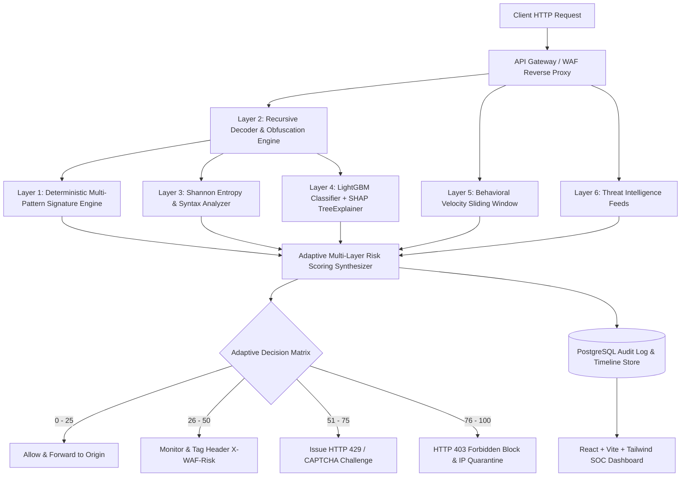
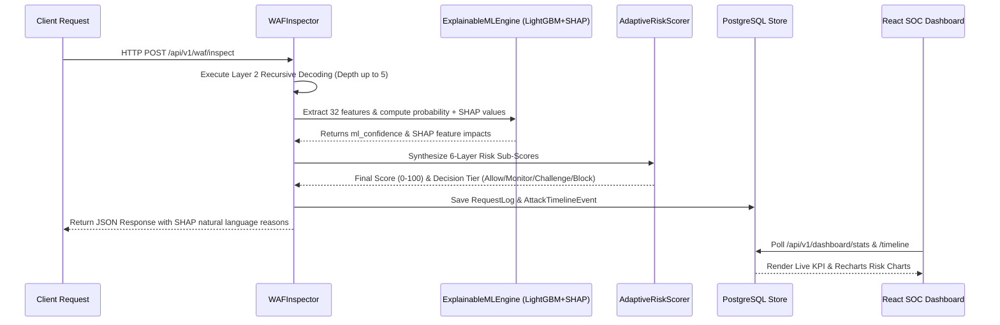

# AMRSF WAF Architecture, UML, and Sequence Diagrams

## 1. Complete AMRSF Pipeline Flowchart

```mermaid
flowchart TD
    Client[Client HTTP Request] --> Gateway[API Gateway / WAF Reverse Proxy]
    Gateway --> Decoder[Layer 2: Recursive Decoder & Obfuscation Engine]
    Decoder --> Sig[Layer 1: Deterministic Multi-Pattern Signature Engine]
    Decoder --> Comp[Layer 3: Shannon Entropy & Syntax Analyzer]
    Decoder --> ML[Layer 4: LightGBM Classifier + SHAP TreeExplainer]
    Gateway --> Beh[Layer 5: Behavioral Velocity Sliding Window]
    Gateway --> Threat[Layer 6: Threat Intelligence Feeds]

    Sig & Comp & ML & Beh & Threat --> Scorer[Adaptive Multi-Layer Risk Scoring Synthesizer]
    Scorer --> Decision{Adaptive Decision Matrix}

    Decision -->|0 - 25| Allow[Allow & Forward to Origin]
    Decision -->|26 - 50| Monitor[Monitor & Tag Header X-WAF-Risk]
    Decision -->|51 - 75| Challenge[Issue HTTP 429 / CAPTCHA Challenge]
    Decision -->|76 - 100| Block[HTTP 403 Forbidden Block & IP Quarantine]

    Scorer --> Logger[(PostgreSQL Audit Log & Timeline Store)]
    Logger --> SOC[React + Vite + Tailwind SOC Dashboard]
```

---

## 2. Sequence Diagram - Request Inspection & XAI Explanation

```mermaid
sequenceDiagram
    participant C as Client Request
    participant I as WAFInspector
    participant ML as ExplainableMLEngine (LightGBM+SHAP)
    participant S as AdaptiveRiskScorer
    participant DB as PostgreSQL Store
    participant SOC as React SOC Dashboard

    C->>I: HTTP POST /api/v1/waf/inspect
    I->>I: Execute Layer 2 Recursive Decoding (Depth up to 5)
    I->>ML: Extract 32 features & compute probability + SHAP values
    ML-->>I: Returns ml_confidence & SHAP feature impacts
    I->>S: Synthesize 6-Layer Risk Sub-Scores
    S-->>I: Final Score (0-100) & Decision Tier (Allow/Monitor/Challenge/Block)
    I->>DB: Save RequestLog & AttackTimelineEvent
    I-->>C: Return JSON Response with SHAP natural language reasons
    SOC->>DB: Poll /api/v1/dashboard/stats & /timeline
    DB-->>SOC: Render Live KPI & Recharts Risk Charts
```
